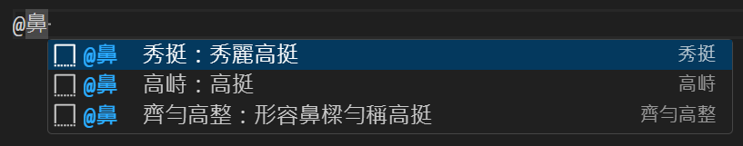

# thesaurus
This repository stores a collection of writing phrases compatible with VSCode user snippets for implementing autocompletion.
It’s a personal tool for enhancing writing efficiency and quality.

## Quick Start

Add the following configuration to your `settings.json` file to enable quick suggestions in Markdown:
```json
    "[markdown]": {
            "editor.quickSuggestions": {
                "comments": "on",
                "strings": "on",
                "other": "on"
            }
    },
```

Edit the `corpus.tsv` file.
```
#觸發符號	類別	詞彙	解釋
@	鼻	秀挺	秀麗高挺
@	鼻	高峙	高挺
```

Convert `corpus.tsv` to JSON format using `snippet_generator.sh`. The generated `corpus.json` can be used as a VSCode snippet file.
```json
{
  "秀挺": {
    "prefix": "@鼻  秀挺：秀麗高挺",
    "body": "秀挺"
  },
  "高峙": {
    "prefix": "@鼻  高峙：高挺",
    "body": "高峙"
  },
}
```

Use in Markdown files


## Setup

1. Clone this repository.
2. Edit `corpus.tsv` with your desired phrases.
3. Run `snippet_generator.sh` to create `corpus.json`.
Follow the [official VSCode instrurction](https://code.visualstudio.com/docs/editor/userdefinedsnippets#_create-your-own-snippets) to add the content of `corpus.json` to your project or global snippets.

## Automating Updates

To keep your snippets up-to-date automatically:
- Set up a Git hook to convert corpus.tsv to corpus.json on each commit.
- Create a softlink from corpus.json to your VSCode snippets file.